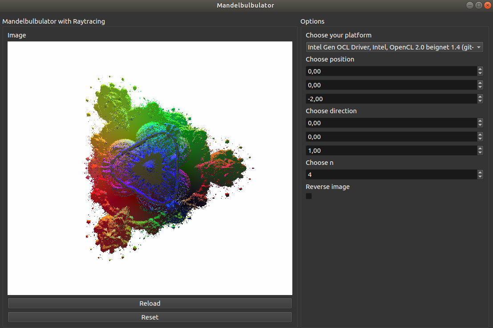
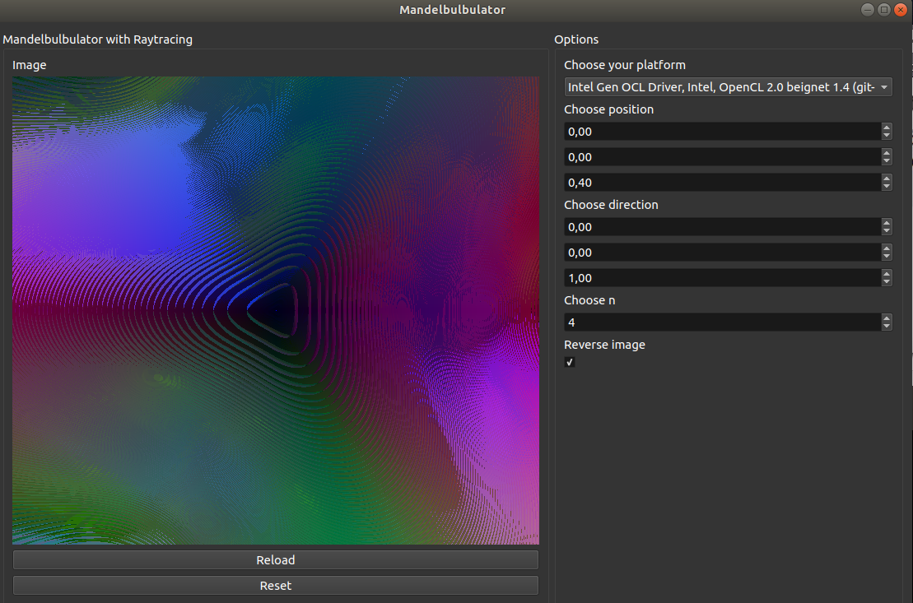

# Mandelbulbulator Project
**Generate Mandelbulbs with OpenCL and Raytracing.**


## Requirements
```bash
pip install -r requirements.txt
```

### Troubleshooting
#### Missing packages
check if you have all these packages installed:
```
pip list
Package             Version 
------------------- --------
appdirs             1.4.3   
atomicwrites        1.2.1   
attrs               18.2.0  
decorator           4.3.0   
Mako                1.0.7   
MarkupSafe          1.1.0   
more-itertools      5.0.0   
numpy               1.15.4  
pip                 10.0.1  
pluggy              0.8.0   
py                  1.7.0   
pybind11            2.2.4   
pyopencl            2018.2.2
PyOpenGL            3.1.0   
PyOpenGL-accelerate 3.1.0   
PyQt5               5.9.2   
pytest              4.0.2   
pytools             2018.5.2
setuptools          39.1.0  
sip                 4.19.8  
six                 1.12.0
```
#### OpenCL
##### With Beignet
[Beignet installation](https://www.freedesktop.org/wiki/Software/Beignet/)
##### More information about OpenCL Installation
[OpenCL How To](https://wiki.tiker.net/OpenCLHowTo)


## Run
```bash
python main.py
```

## Troubleshooting
### Image is not fully rendered
That is because of timeouts on your graphic card.
Try turing them off:
```
sudo su
echo -n 0 > /sys/module/i915/parameters/enable_hangcheck
```

## Authors
Mateusz Gniewkowski
Beata Szeląg


